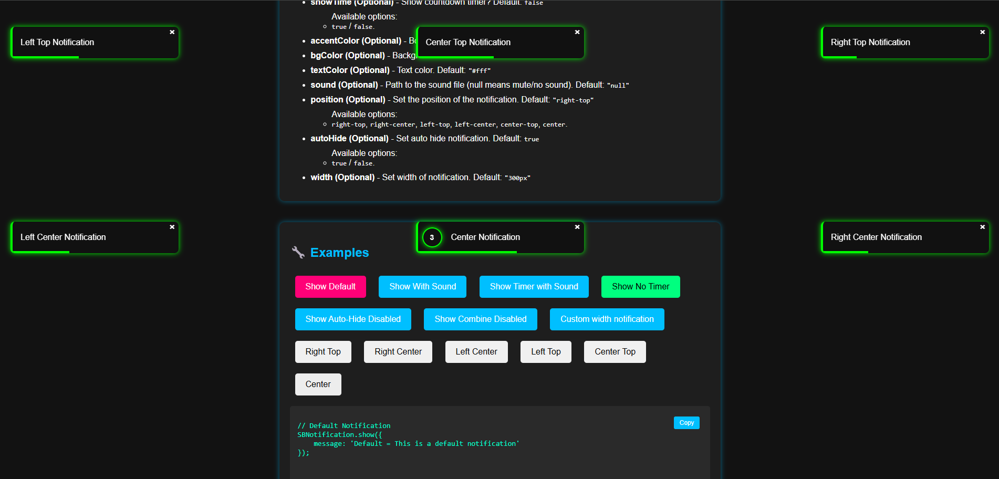

# SBNotification

SBNotification is a simple JavaScript notification library with sound and accent color support.

## 🚀 Features

- Customizable notifications with text, duration, sound, and accent color.
- Optional countdown timer display.
- Lightweight and easy to integrate.

## 📥 Installation

Include the script in your project:

```html
<script src="https://cdn.jsdelivr.net/gh/suryabhaiin/sbnotification@main/sb-notification.js"></script>
```

## ⚡ Usage

Call the `SBNotification.show()` function to display a notification:

```javascript
SBNotification.show('Notification Text', duration, showTime, soundFile, accentColor);
```

## 📌 Parameters

- `message` (Required) - The text to display in the notification.
- `duration` (Required) - Time (in seconds) before the notification disappears.
- `showTime` (Required) - Show countdown timer? (`true` / `false`)
- `accentColor` (Required) - Border and glow color (default: `"#00ffff"`)
- `soundFile` (Optional) - Path to the sound file (default:  `null`)

## 🔧 Examples

### Default Notification

```javascript
SBNotification.show('Default = This is a default notification');
```

### Custom Notification with Sound

```javascript
SBNotification.show('Custom = This is a custom notification', 10, true, 'success.wav', '#ff0000');
```

### Notification Without Timer

```javascript
SBNotification.show('No Timer = No timer counter notification', 10, false, '#00ff00');
```
## 📸 Screenshot



## 🎉 License

This project is licensed under the MIT License.

---

### 📌 Contribution

Feel free to submit issues or pull requests to improve SBNotification!

Happy coding! 🚀
